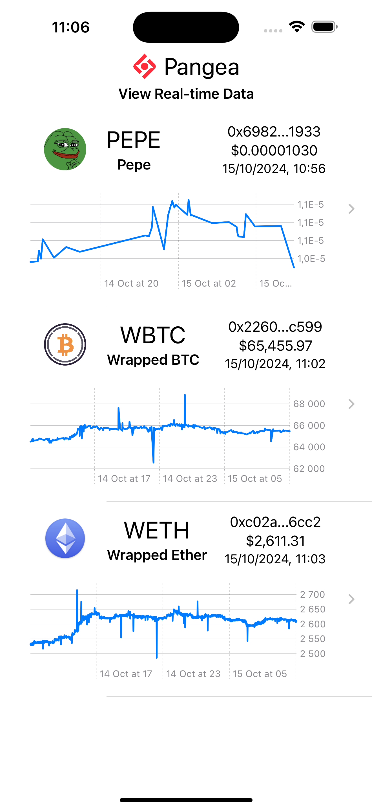
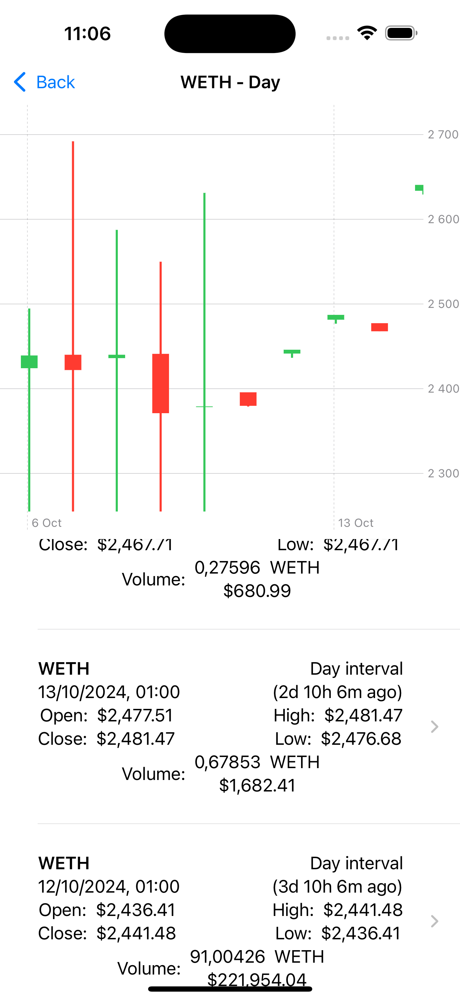
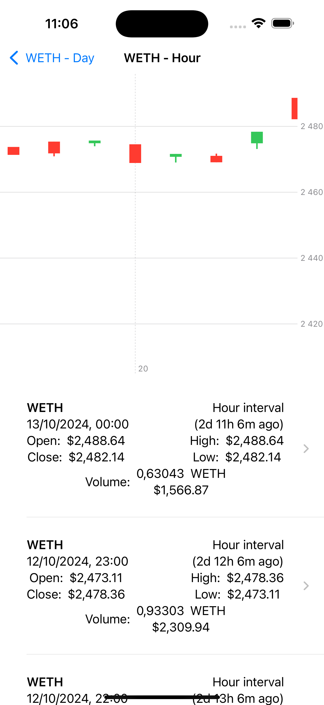
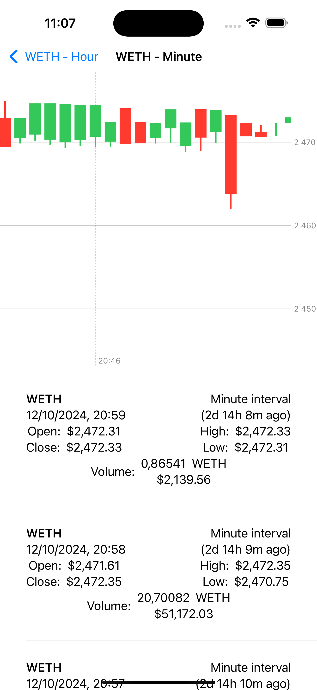
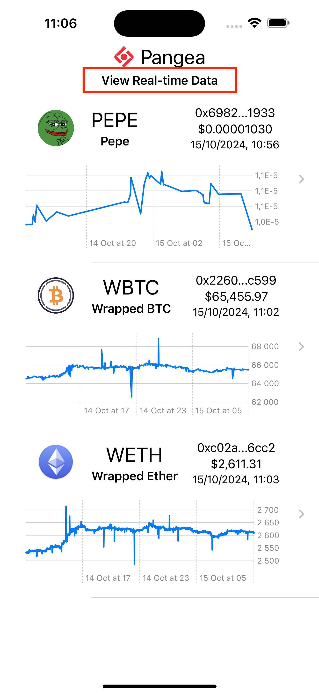
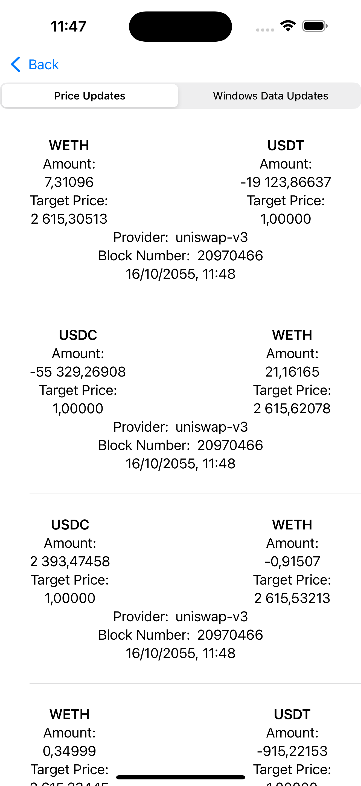
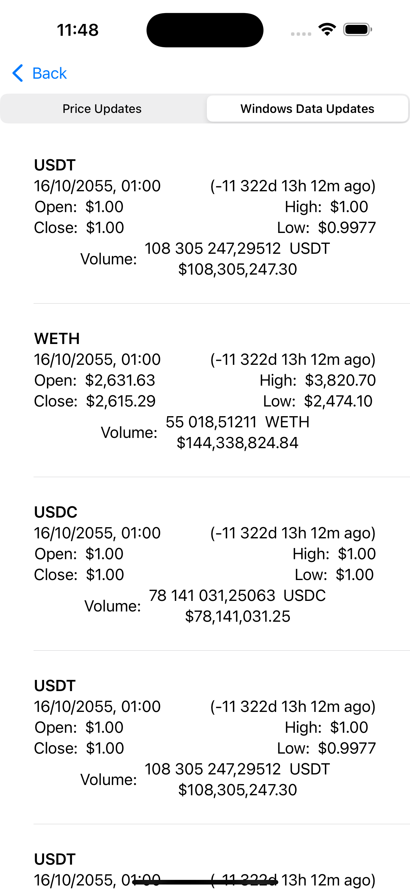

# Pangea Pioneer


## About This App

A native iOS app to explore the data from Pangea. This app lets you explore historical data, presented in the form of candlestick charts, and also look at a real-time stream of prices and token transactions.

This is written in Swift, using [SwiftUI](https://developer.apple.com/xcode/swiftui/) and [Swift Charts](https://developer.apple.com/documentation/charts)


## Prerequisites

This app is targeted at iOS version 17.5 and uses Swift 6.  You will need the most recent version of XCode to build it and an updated device to run it on (or just use the Simulator).

Additionally, you will need credentials to access Pangea data.  You can request those here: 
<https://docs.pangea.foundation/#client-access>


## Installation

1. First, clone this repo, open in Xcode, and build.

```
git clone git@github.com:PangeaFoundation/Pioneer.git
```

2. Open the project.

```
cd Pioneer
open Pioneer.xcodeproj
```

3. Open the file `Config.xcconfig`.  You will see a line that says

```
PANGEA_AUTH = [Your Credentials Here]
```

Replace this with your credentials.

4. Build and run


## Usage

The first screen displays a list of tokens and a line graph with recent prices.



Tap on a token to see a list of prices by day.  



Selecting a day will show prices by the hour for that day.  



Selecting an hour will show you prices by the minute for that hour.



Also on the first screen, you can select real-time data.  



You can switch between "Price Updates" which will show any new transactions.



And "Windows Data Updates" which will show any price updates for a time interval.



